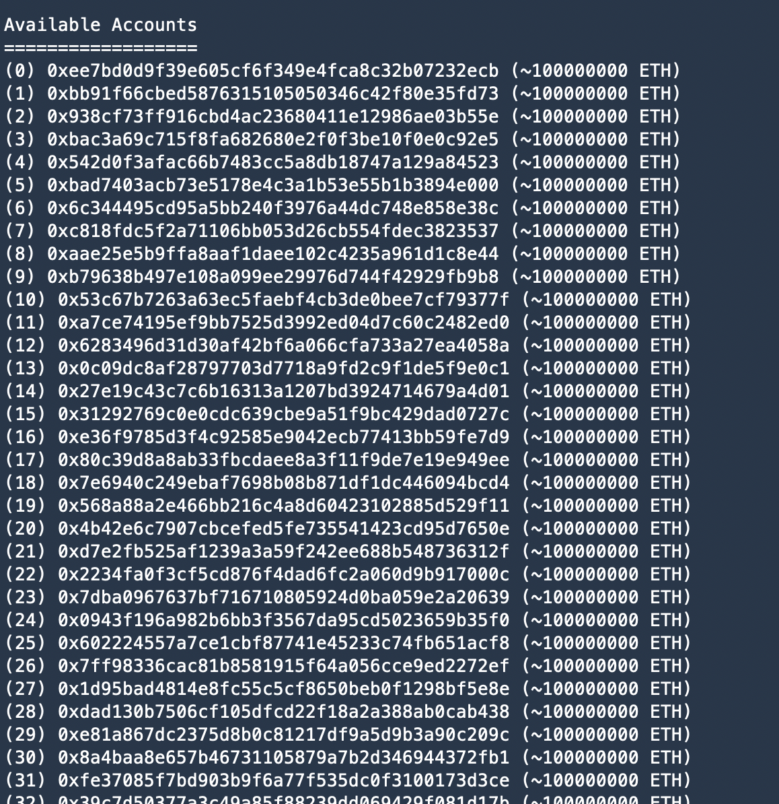
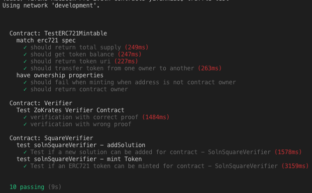
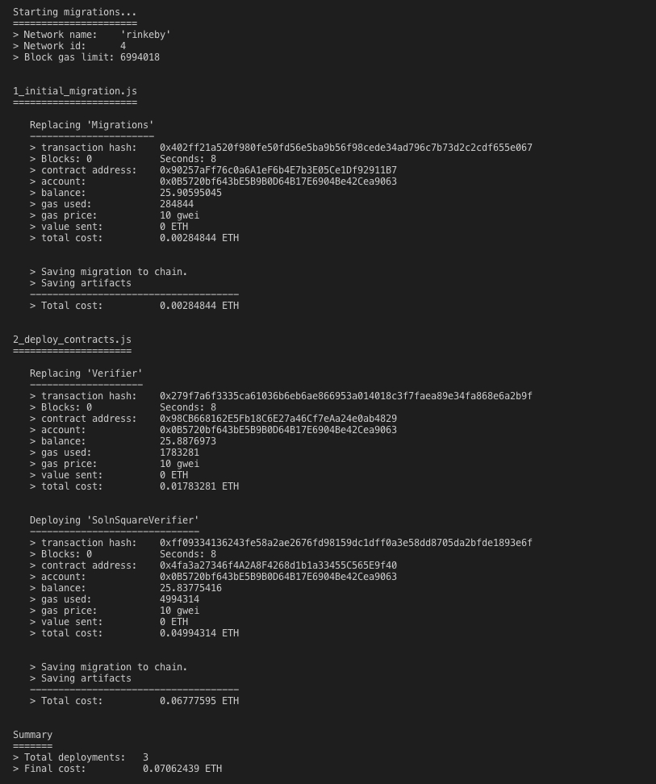

# Udacity Blockchain Capstone

This is the capstone application for Udacity Blockchain Nanodegree 

## Start

Installing all packages( in the directory contains package.json)
```
npm instal 
```
To start Ganache-cli for local deployment and testing: 
`ganache-cli --gasLimit 300000000 --gasPrice 20000000000 -a 50 -m "forget chief exist liberty video cash twelve nest grief umbrella panel trumpet" -e 10000000`

we will have accounts: 



To install, download or clone the repo, then in the directory contains package.json run:

`npm install`
`truffle compile`

## Develop Client

To run truffle tests:

`truffle test`

result will show all passed: 



To deploy the app to Rinkeby test network: 



The deployed addresses are: 

* Deploying 'Verifier'
```
    contract address:    0x98CB668162E5Fb18C6E27a46Cf7eAa24e0ab4829
```
* Deploying 'SolnSquareVerifier'
```
    contract address:    0x4fa3a27346f4A2A8F4268d1b1a33455C565E9f40
```

and in etherscan shows: 
`https://rinkeby.etherscan.io/address/0x4fa3a27346f4A2A8F4268d1b1a33455C565E9f40`

## Mint tokens

10 tokens minted

```

1.  Minted token. Transaction: 0xd02fdc2b02f8241e401562339ce0d44ecc3910c2478143c415166b5744709ed6, Token ID: 40
2.  Minted token. Transaction: 0x2807043e66d3998012c6a7b704ee5edc058fc83ae72013e1040776d4bb782d8f, Token ID: 10 
3.  Minted token. Transaction: 0x4f1bb945aa3f1c1e961290ce2a8b70f42921b099b2552bef5042cd73f12b09a5, Token ID: 11
4.  Minted token. Transaction: 0x8563934cd1607f5423ae008ed2ea030b43bfad877e856599e593af0f3c45537c, Token ID: 12
5.  Minted token. Transaction: 0x597458780664fca0d096946d2087b728e084e5fdb3f1b593062b3a992c888de6, Token ID: 13
6.  Minted token. Transaction: 0x04b00ccd3a4a3c1f6b524f446b8106abeb295427b91403e511f669fc154d1424, Token ID: 19 
7.  Minted token. Transaction: 0x617ed2c62790bf4615382d4eb1a72f6ffd87a004b353fe27ed76e096b056617f, Token ID: 20
8.  Minted token. Transaction: 0x86586d5e688753d2ef3268b5fc94f15fd8f56e321d4d5717f46bbecf5b84758c, Token ID: 35
9.  Minted token. Transaction: 0x53a97a21f7ae8b0d2bfd7d52dfafc48ce63505246f843c95a4ec89b00c9a6f55, Token ID: 51 
10. Minted token. Transaction: 0xf36167dd502e4e1f56a3f4be01deed86f7e7459d3e54bbeb4b874c608cc1474e, Token ID: 60

```


# Project Resources

* [Remix - Solidity IDE](https://remix.ethereum.org/)
* [Visual Studio Code](https://code.visualstudio.com/)
* [Truffle Framework](https://truffleframework.com/)
* [Ganache - One Click Blockchain](https://truffleframework.com/ganache)
* [Open Zeppelin ](https://openzeppelin.org/)
* [Interactive zero knowledge 3-colorability demonstration](http://web.mit.edu/~ezyang/Public/graph/svg.html)
* [Docker](https://docs.docker.com/install/)
* [ZoKrates](https://github.com/Zokrates/ZoKrates)
