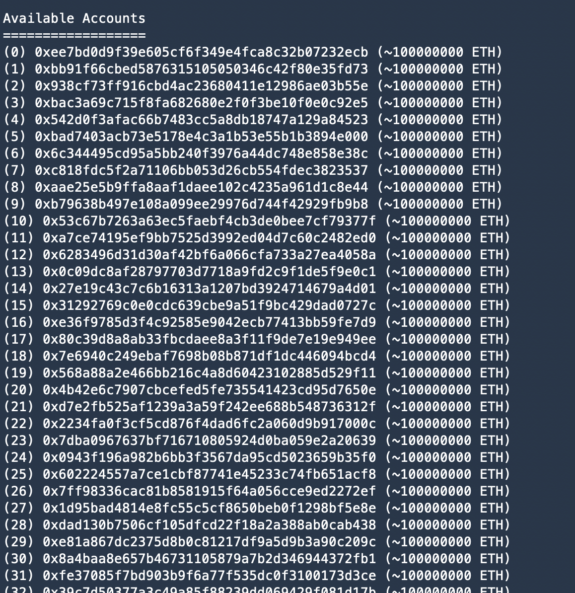
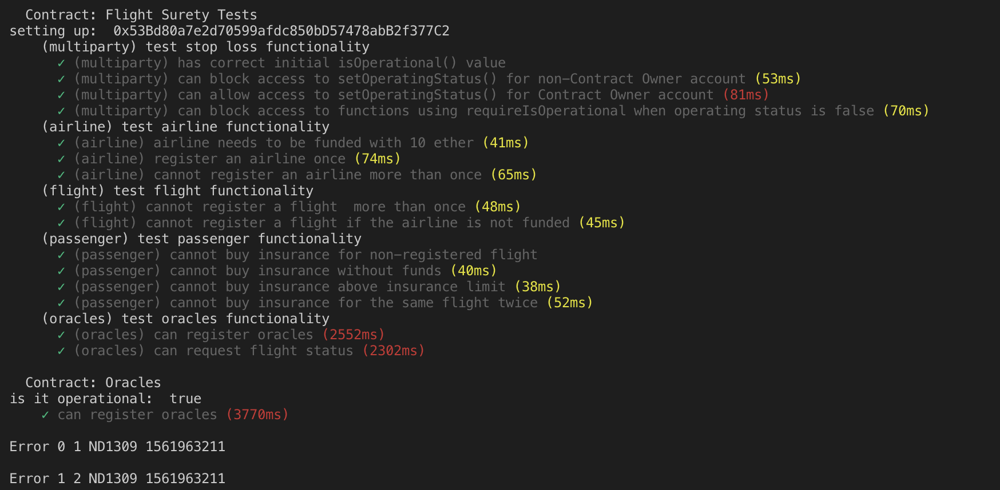
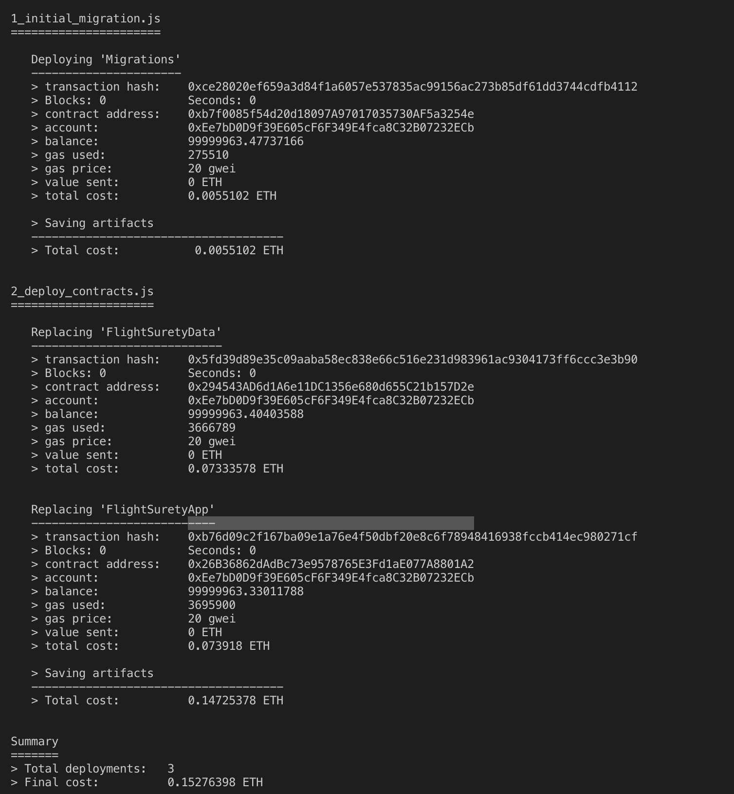
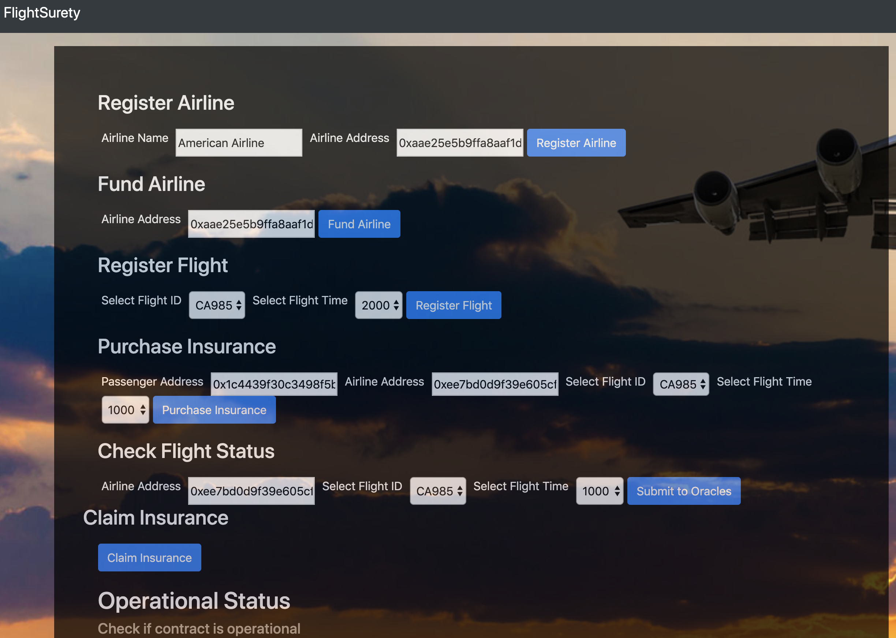
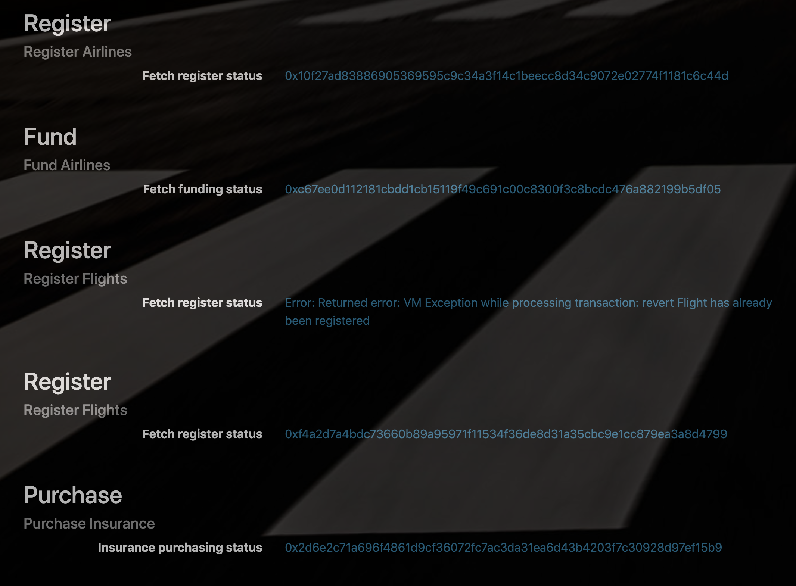

# FlightSurety

FlightSurety is a sample application project for Udacity's Blockchain course.

## Install

This repository contains Smart Contract code in Solidity (using Truffle), tests (also using Truffle), dApp scaffolding (using HTML, CSS and JS) and server app scaffolding.

To start Ganache-cli for local deployment and testing: 
`ganache-cli --gasLimit 300000000 --gasPrice 20000000000 -a 50 -m "forget chief exist liberty video cash twelve nest grief umbrella panel trumpet" -e 10000000`

we will have accounts: 

To install, download or clone the repo, then:

`npm install`
`truffle compile`

## Develop Client

To run truffle tests:

`truffle test ./test/flightSurety.js`
`truffle test ./test/oracles.js`

To use the dapp:

`truffle migrate`

`npm run dapp`

To view dapp:

`http://localhost:8000`

and the UI will look like: 

To test functions from UI, here are some exaamples for transaction history:

## Develop Server

`npm run server`

and you can see 20 oracles could be registered

## Deploy

To build dapp for prod:
`npm run dapp:prod`

Deploy the contents of the ./dapp folder

## Resources

* [How does Ethereum work anyway?](https://medium.com/@preethikasireddy/how-does-ethereum-work-anyway-22d1df506369)
* [BIP39 Mnemonic Generator](https://iancoleman.io/bip39/)
* [Truffle Framework](http://truffleframework.com/)
* [Ganache Local Blockchain](http://truffleframework.com/ganache/)
* [Remix Solidity IDE](https://remix.ethereum.org/)
* [Solidity Language Reference](http://solidity.readthedocs.io/en/v0.4.24/)
* [Ethereum Blockchain Explorer](https://etherscan.io/)
* [Web3Js Reference](https://github.com/ethereum/wiki/wiki/JavaScript-API)