# Supply chain & data auditing

This repository containts an Ethereum DApp that demonstrates a Supply Chain flow between a Seller and Buyer. The user story is similar to any commonly used supply chain process. A Seller can add items to the inventory system stored in the blockchain. A Buyer can purchase such items from the inventory system. Additionally a Seller can mark an item as Shipped, and similarly a Buyer can mark an item as Received.

## UML diagrams

The diagrams folder contains the UML diagrams for the supply chain.

### Activity diagram

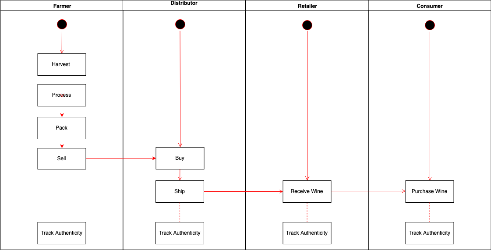

### Sequence diagram

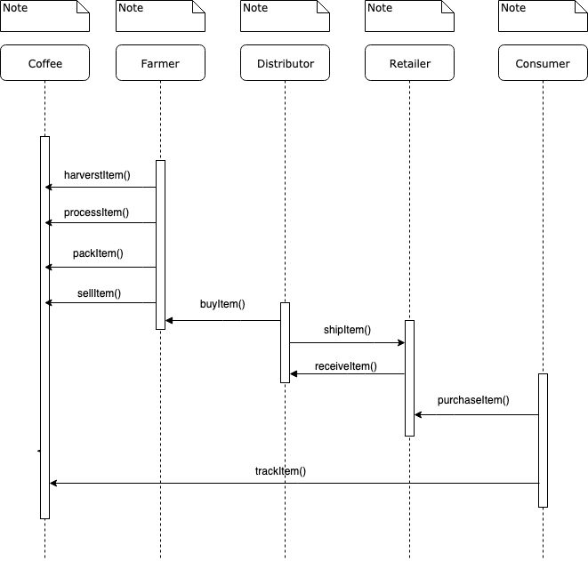

### State diagram

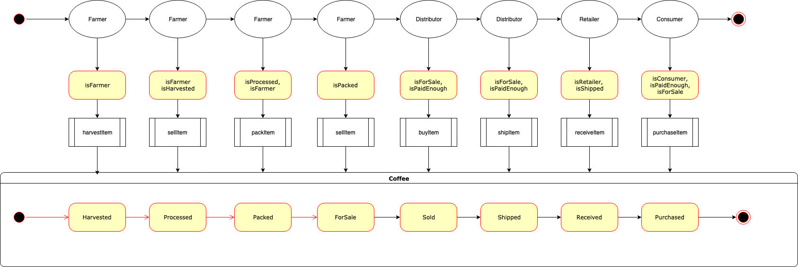

### Classes diagram

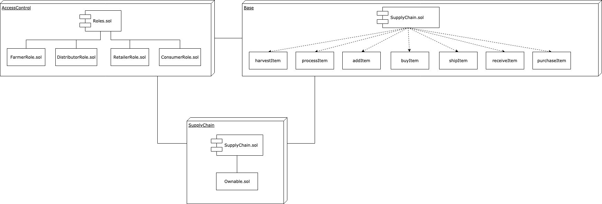


The DApp User Interface when running should look like...

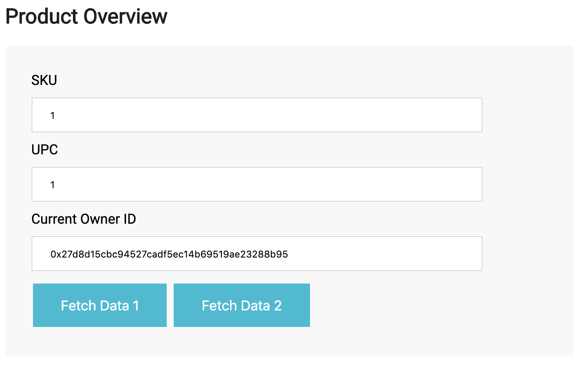

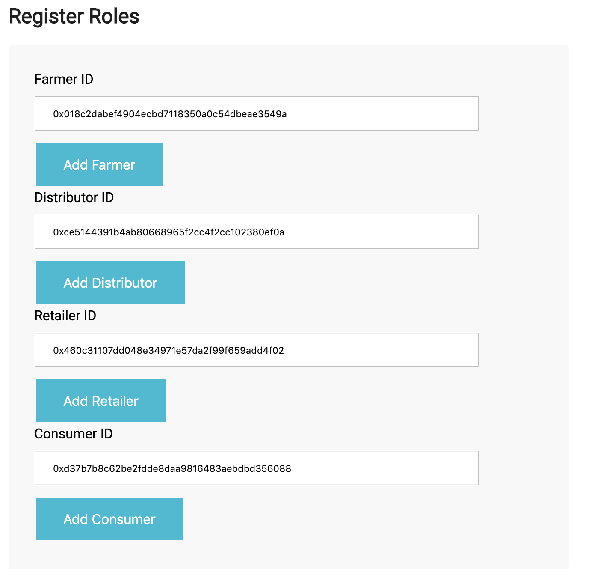

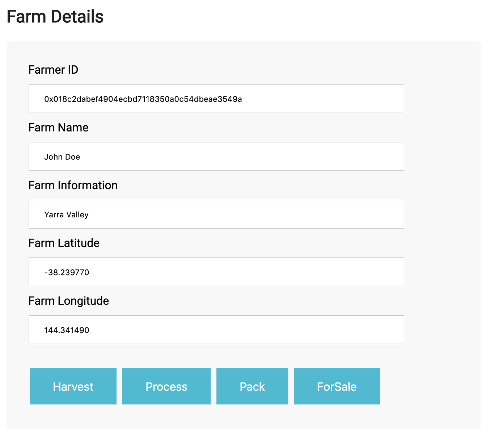

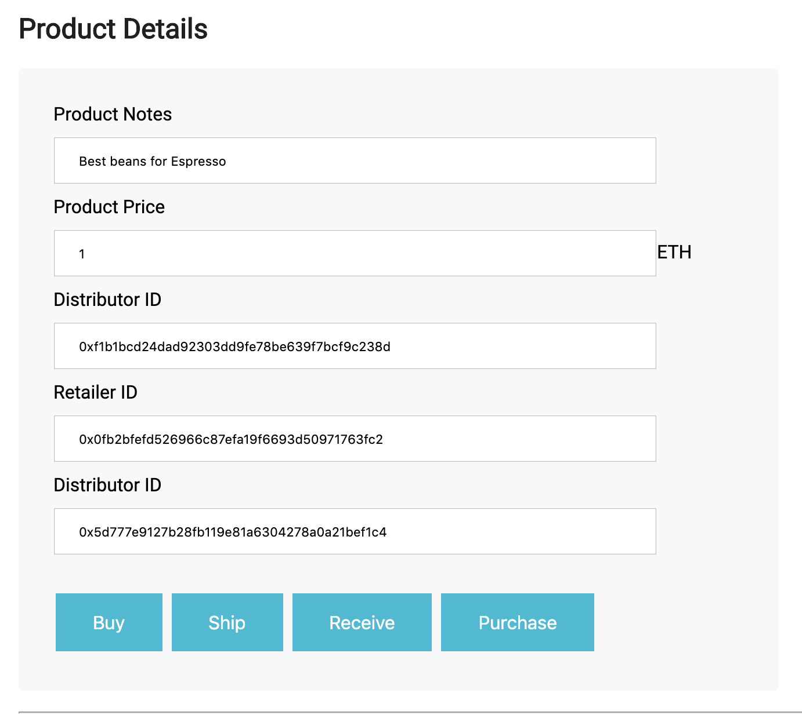

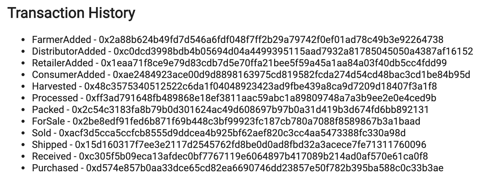


## Getting Started

These instructions will get you a copy of the project up and running on your local machine for development and testing purposes. See deployment for notes on how to deploy the project on a live system.

### Prerequisites

Please make sure you've already installed ganache-cli, Truffle and enabled MetaMask extension in your browser.

### Installing

A step by step series of examples that tell you have to get a development env running

Clone this repository:

```
git clone https://github.com/udacity/nd1309/tree/master/course-5/project-6
```

Change directory to ```project-6``` folder and install all requisite npm packages (as listed in ```package.json```):

```
cd project-6
npm install
```

Launch Ganache:

```
ganache-cli -m "spirit supply whale amount human item harsh scare congress discover talent hamster"
```

Your terminal should look something like this:

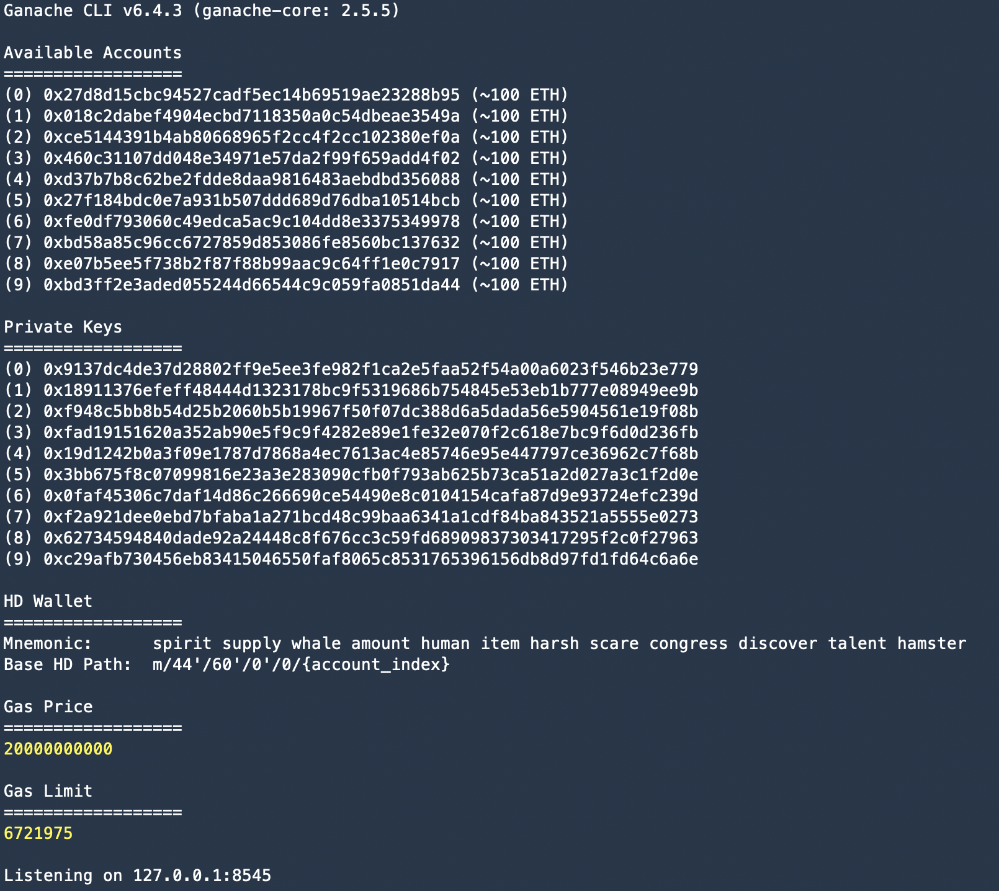

In a separate terminal window, Compile smart contracts:

```
truffle compile
```

This will create the smart contract artifacts in folder ```build\contracts```.

Migrate smart contracts to the locally running blockchain, ganache-cli:

```
truffle migrate
```

Your terminal should look something like this:

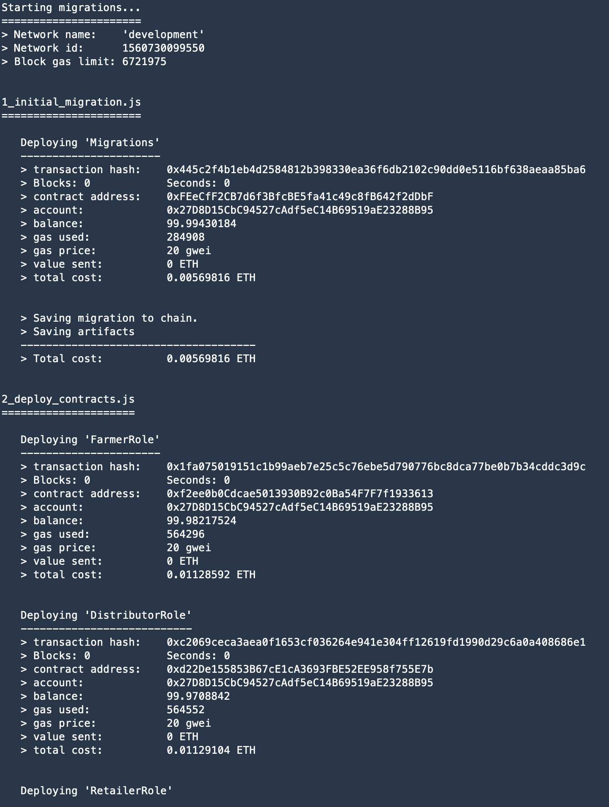

Test smart contracts:

```
truffle test
```

All 11 tests should pass.

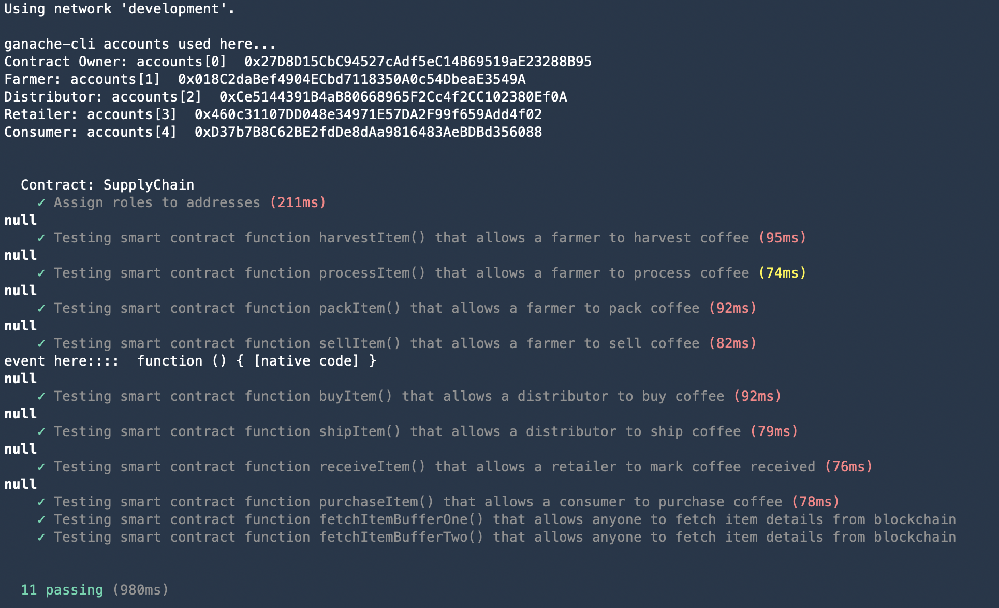

In a separate terminal window, launch the DApp:

```
npm run dev
```

## Address on Rinkeby

Transaction ID
0xad1c4bd38ce2d3a0a9faf7be5db2675e9c448c331b45fd6b6188a66532619d50

Contract address
https://rinkeby.etherscan.io/address/0xd33D5AB3521af20B11fC9118fBA9868d50dF5463


## Built With

* [Ethereum](https://www.ethereum.org/) - Ethereum is a decentralized platform that runs smart contracts
* [Truffle Framework](http://truffleframework.com/) - Truffle is the most popular development framework for Ethereum with a mission to make your life a whole lot easier.

## Versions

* Truffle v5.0.2 (core: 5.0.2)
* Solidity v0.5.0 (solc-js)
* Node v10.15.0
* Web3 1.0.0-beta.55